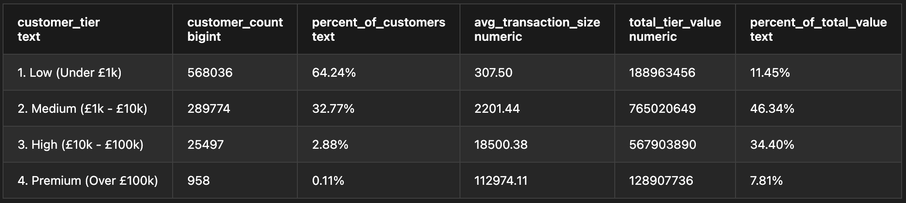

# Analysing Customer Spending & Revenue Concentration

## Overview

This project uses SQL to analyse over 1 million customer transactions, segmenting customers into spending tiers to identify where revenue concentrates and which customer segments drive the most value. It was built entirely in PostgreSQL to demonstrate querying and summarising customer data at a scale spreadsheet tools like Excel cannot practically handle, a core skill for customer analytics and business analyst roles in financial services.

&nbsp;

## Why This Project Matters

Understanding customer value distribution is critical for financial institutions to allocate resources effectively. Not all customers generate equal value, and identifying which customer segments drive the most revenue allows business teams to focus retention efforts, marketing spend, and relationship management on high-impact groups. This kind of customer segmentation sits behind many real operational decisions, from which customers receive premium service tiers to how customer acquisition budgets are allocated across different spending segments.

&nbsp;

## Dataset

The data comes from a Bank Customer Segmentation dataset available on Kaggle containing over 1 million transactions from an Indian retail bank. It contains over 1,000,000 records across nine columns, including customer demographics, transaction amounts, account balance information, and transaction timestamps.

&nbsp;

## Methodology

**1) Set Up the Database:** 
The dataset was loaded into a PostgreSQL database, with a table structured to match the nine columns in the source file.

**2) Import the Data:** 
All 1,048,567 transactions were imported directly into PostgreSQL using the COPY command, avoiding the performance limits of spreadsheet tools at this scale.

**3) Segment and Analyse:** 
Customers were grouped into four spending tiers based on their total transaction value, from under £1,000 to over £100,000. 
SQL aggregation functions and CTEs were used to calculate each tiers share of total customer count alongside its share of total transaction value, both within a single query.

&nbsp;

**Table 1: Customer Distribution and Revenue Concentration by Spending Tier**

Segments every customer into one of four spending bands to analyze customer value concentration. It displays the total customer count and percentage share for each tier, alongside the average transaction size and total revenue contribution.

&nbsp;

The Medium-tier customers (£1k - £10k) represent just 32.77% of the customer base, yet generate 46.34% of all transaction value, making this segment the primary revenue driver. This concentration of value in a relatively small customer group is the kind of pattern a business team would want surfaced early to prioritise retention efforts, rather than treating every customer segment as equally valuable.

The analysis reveals that Low-tier customers (Under £1k) make up 64% of the customer base but contribute only 11.45% of revenue, while High and Premium tiers combined account for just 3% of customers but drive 42.21% of value. This skew towards medium and high-value customers demonstrates healthy revenue diversification and highlights where strategic customer relationship investments would yield the greatest return.
